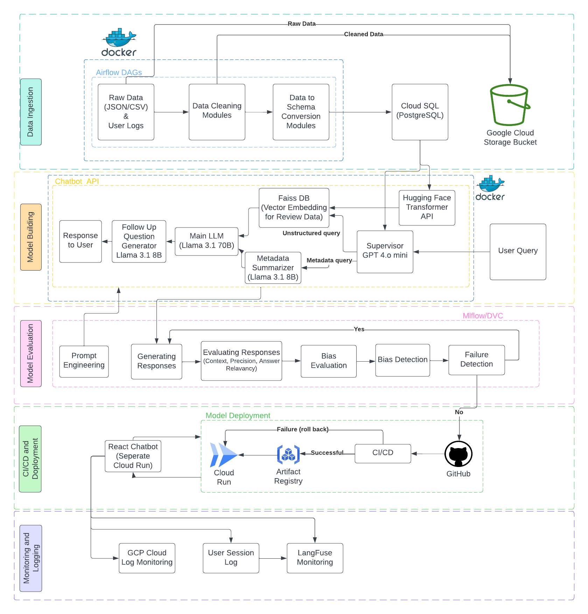

# Verta - A LLM Chatbot

| Name          | Email           |
|---------------|-----------------|
| Bharath Gajula | gajula.b@northeastern.edu |
| Divya Sri Bandaru | bandaru.di@northeastern.edu |
| Henil Gajjar | gajjar.he@northeastern.edu |
| Nishith Reddy Pochareddy | pochareddy.n@northeastern.edu |
| Soumyae Tyagi | tyagi.so@northeastern.edu |
| Fatima Jawadwala | jawadwala.f@northeastern.edu |

## Table of Contents
1. [Introduction](../project/1-introduction.md)
2. [Scoping](../project/2-scoping.md)
3. [Data](../project/3-data.md)
4. [Modeling](../project/4-modelling.md)
5. [CI/CD](../project/5-ci_cd.md)
6. [Logging and Monitoring](../project/6-logging.md)
7. [Cost Analysis](../project/7-cost_analysis.md)

## Introduction
### 1. Problem Statement
Customers often struggle to find accurate and personalized answers to their product-related questions. Product descriptions can be overwhelming, and user reviews are scattered and hard to analyze. Businesses also face challenges in ensuring fair and unbiased responses while maintaining the reliability and scalability of their systems.

This project aims to create an AI-powered chatbot that combines product details and user reviews using a multi-agent workflow and a vector store for efficient retrieval. The solution leverages GPT-based LLMs for natural language understanding and CI/CD pipelines for seamless deployment. It focuses on delivering fast, reliable, and unbiased information while being easy to integrate into various platforms through a FASTAPI serverless API.

### 2. Methodology
**1. Data Collection and Preprocessing:** For this project, we utilized the Amazon Product metadata and review dataset for the Toys & Games and Video Games categories. Following this, the data was cleaned and converted into a schema-based format, which was then utilized for our project.

**2. Model Implementation:**  We used four different LLMs in our application: GPT-4o Mini as a supervisor agent, Hugging Face for generating embeddings, Llama 3.1 8B as an agent for summarizing and follow-up question generation, and Llama 3.1 70B as the responding agent.

**3. Model Evaluation:** Used RAGAS to evaluate our model's performance for specific prompts based on the following metrics: Context, Precision, Answer Relevance.

**4. Bias Detection:** For the given prompts, we conducted sentiment analysis and calculated the percentage distribution across three sentiment categories: positive, negative, and neutral. By rerunning this module, any changes in this distribution can be detected. If significant changes are observed, it may indicate the presence of bias.

**5. CI/CD/CM:** GitHub Actions is used to implement CI/CD processes, enabling us to deploy and run our project on GCP using Cloud Run. For monitoring, we utilized GCP Cloud Monitoring and Langfuse for tracking model responses.

### 3. Goals
* Enhance the eCommerce shopping experience by addressing challenges in navigating product reviews and information.
 
* Develop an intelligent chatbot using Retrieval-Augmented Generation (RAG) to streamline the process of finding relevant insights from vast review datasets and product metadata, providing real-time, context-specific answers to customer queries.
 
* Improve customer satisfaction by providing personalized recommendations and accurate responses to nuanced questions.
 
* Integrate seamlessly with existing eCommerce platforms to create a scalable, impactful solution.

The source code for our project can be found here:  [GitHub](https://github.com/eCom-dev5/eCom-Chatbot).

The source code for the E-Com web application we developed can be found here: [GitHub-UI-Code](https://github.com/eCom-dev5/eCom-Chatbot-UI).

### 4. Tools Used for MLOps

* [Python 3.12](https://www.python.org/)
* [PIP 24.3](https://pypi.org/project/pip/)
* [GitHub Actions](https://github.com/features/actions)
* [AirFlow](https://airflow.apache.org/)
* [MLflow](https://mlflow.org/)
* [GPT 4.0 mini](https://openai.com/index/gpt-4o-mini-advancing-cost-efficient-intelligence/), [Llama3.1 8B](https://huggingface.co/meta-llama/Llama-3.1-8B), [Llama3.1 70B](https://huggingface.co/meta-llama/Llama-3.1-70B) and [HuggingFace Transformer](https://huggingface.co/sentence-transformers/all-MiniLM-L6-v2)
* [Faiss DB](https://engineering.fb.com/2017/03/29/data-infrastructure/faiss-a-library-for-efficient-similarity-search/)
* [Docker](https://www.docker.com/)
* [Google Cloud Platform](https://cloud.google.com/) (Buckets, Cloudrun, CloudSQL, Cloud Log Monitoring and Artifact Registry)
* [LangFuse](https://langfuse.com/) (Monitoring & Dashboards)

### 5. Project Architecture

