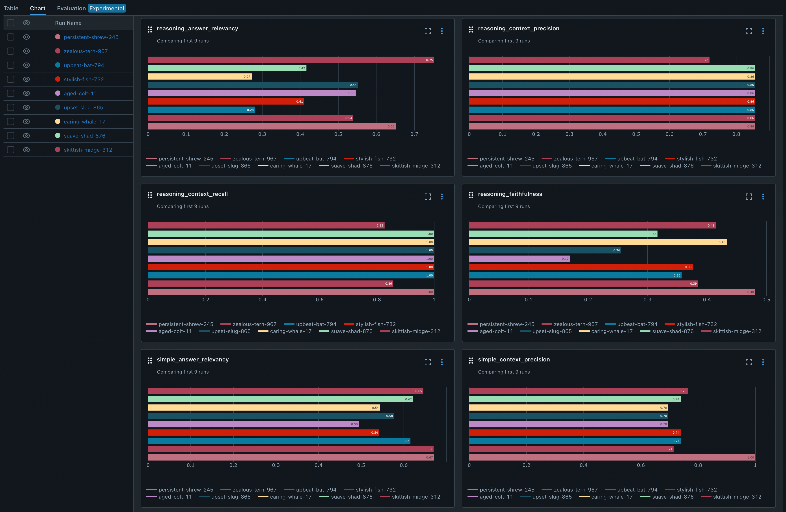

# Modeling

## Table of Contents
1. [Introduction](../project/1-introduction.md)
2. [Scoping](../project/2-scoping.md)
3. [Data](../project/3-data.md)
4. [Modeling](../project/4-modelling.md)
5. [CI/CD](../project/5-ci_cd.md)
6. [Logging and Monitoring](../project/6-logging.md)
7. [Cost Analysis](../project/7-cost_analysis.md)

## Model Overview
The Verta (Base Model) Chatbot is designed to handle user queries in real-time with high accuracy and contextual understanding. It combines advanced retrieval systems, metadata summarization, and state-of-the-art generative language models to deliver clear and engaging responses. At the heart of the system is a Supervisor Module that orchestrates all these components seamlessly.

To ensure smooth operation and efficiency, the chatbot integrates with LangFuse, which helps monitor query traces, track token usage, and manage costs effectively. This modular and scalable setup makes it perfect for real-world applications like retrieving product information, providing customer support, and offering personalized recommendations.

## Base Model Architecture

**1. Metadata Summarizer**
- **Model:** llama3.1-8b
- **Role**:
   - Summarizes structured data into concise and readable formats.
- **Workflow**:
   - Processes structured metadata (e.g., product specs, features, pricing).
   - Outputs a human-readable summary for the Main LLM to use in response generation.
- **Example**:
   - Input: Product metadata.
   - Output: "This product features lightweight design, noise cancellation, and a 10-hour battery life."

**2. Supervisor Module**
- **Model:** GPT-4o-mini
- **Role**:
   - Acts as the decision-making layer, routing queries based on their type (metadata vs. unstructured).
- **Workflow**:
   - Receives user queries through the `dev/stream` API.
   - Routes queries to either the Metadata Retriever or the Vectorstore Retriever.

**3. Vectorstore Retriever**
- **Database**: FAISS Vectorstore
- **Embedding Model**: HuggingFace All-MiniLM-v6
- **Role**:
   - Retrieves unstructured textual data (e.g., reviews, descriptions) using vector embeddings.
- **Workflow**:
   - Converts textual data into vector embeddings using HuggingFace's MiniLM.
   - Stores and retrieves embeddings using FAISS for fast similarity-based searches.
   - Fetches contextually relevant documents for user queries.
   - Handles unstructured data retrieval using vector similarity techniques.

**4. Main LLM**
- **Model:** llama3.1-70b
- **Role**:
   - Synthesizes a comprehensive response by combining:
     - User inputs.
     - Metadata summaries.
     - Contextual information from retrieved documents.
- **Workflow**:
   - Receives preprocessed data from the Metadata Summarizer and Vectorstore Retriever.
   - Generates coherent, detailed, and context-aware responses.
- **Example**:
   - Input: “What are the best features of this product?”
   - Output: "The product offers industry-leading noise cancellation, lightweight construction, and a battery life of 10 hours."

**5. Follow-up Question Generator**
- **Model:** llama3.1-70b
- **Role**:
   - Enhances the user experience by generating relevant follow-up questions.
- **Workflow**:
   - Evaluates the interaction context and the generated response.
   - Suggests clarifying or exploratory follow-up queries.
- **Example**:
   - "Would you like me to compare this product with similar options?"

**6. LangFuse Analytics**
- **Role**:
   - Monitors and logs operational metrics across the entire pipeline.
- **Features**:
   - **Trace Logging**: Tracks module inputs, outputs, and execution times.
   - **Token Monitoring**: Logs token consumption for summarization, retrieval, and response generation.
   - **Cost Attribution**: Provides insights into the costs of API interactions and token usage.
- **Use Case**:
   - Analyzing the pipeline’s efficiency and optimizing cost-to-performance ratios.

## Model Pipeline Execution Workflow

1. **User Query Submission**  
   - Users interact with the chatbot via the frontend interface, which sends queries to the backend through the `dev/stream` API.

2. **Metadata Summarization**  
   - Summarizes structured metadata for clarity and brevity.

3. **Supervisor Routing**  
   - The Supervisor Module determines whether the query relates to the main llm or unstructured contextual data.

3. **Data Retrieval**  
   - Contextual queries → Vectorstore Retriever retrieves relevant unstructured data.

4. **Response Generation**  
   - The Main LLM combines all inputs to generate a coherent and relevant response.

5. **Follow-up Engagement**  
   - A follow-up query is generated to improve user interaction and clarify ambiguous queries.

6. **Analytics Logging**  
   - [LangFuse](https://langfuse.com/) logs the entire interaction, including token usage, trace data, and performance metrics.

## Model Evaluation
The `model_evaluation` pipeline evaluates chatbot responses by leveraging user reviews, metadata, and test datasets. The evaluation metrics include **context precision**, **faithfulness**, **answer relevancy**, and **context recall**. The pipeline supports modular experimentation by allowing parameter and configuration adjustments in the `config/` folder.

**Metrics and Insights**

| Metric              | Description                                                     |
|---------------------|-----------------------------------------------------------------|
| **Context Precision** | Accuracy of retrieved context in relation to the question.     |
| **Faithfulness**      | Alignment of the answer with factual product data.            |
| **Answer Relevancy**  | Relevance of the response to the user’s query.                |
| **Context Recall**    | Completeness of the retrieved context in relation to the question. |

#### MLFlow to Compare Multiple Versions of the Model

[MLFlow](https://mlflow.org/) is an integral part of our MLOps pipeline, providing model versioning, management, and serving capabilities.

**Model Version Comparisons**:
  Comparisons between various Prompts and the evaluation metrics
  
  

More detailed documentation for the model evaluation pipeline is available:  [Model Evaluation doc.](https://github.com/eCom-dev5/eCom-Chatbot/blob/dev/readme/03_MODEL_EVALUATION.md)

## Bias Detection
The `bias_detection` pipeline identifies biases in product reviews using sentiment analysis, embeddings, and metadata. It flags issues like focusing too much on negative reviews, ignoring limited data, and unbalanced sentiment. The pipeline supports modular experimentation by allowing parameter and configuration adjustments in the `config/` directory.

**Metrics and Insights**

| Metric                   | Description                                                                                    |
|--------------------------|------------------------------------------------------------------------------------------------|
| **bias detected count**  | Tracks the total number of responses for a specific ASIN that have been flagged as biased.     |
| **bias types**           | A set of distinct bias types identified for a specific ASIN.                                   |
| **num reviews**          | total number of product reviews retrieved and analyzed for each ASIN.                          |
| **review sentiments**    | A breakdown of the sentiment distribution (positive, neutral, negative).                       |

More detailed documentation for the bias detection pipeline can be found here:  [Bias Detection doc.](https://github.com/eCom-dev5/eCom-Chatbot/blob/dev/readme/04_BIAS_DETECTION.md)