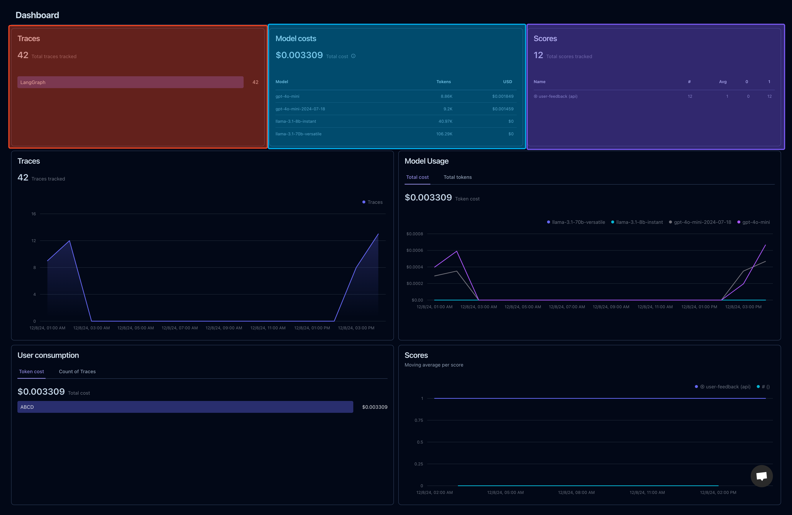
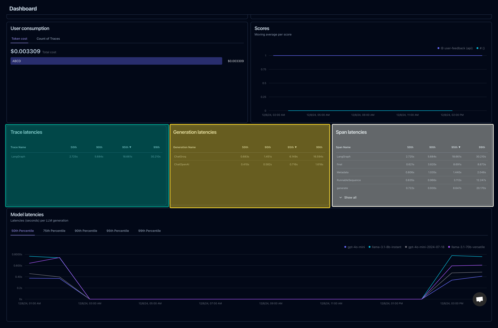
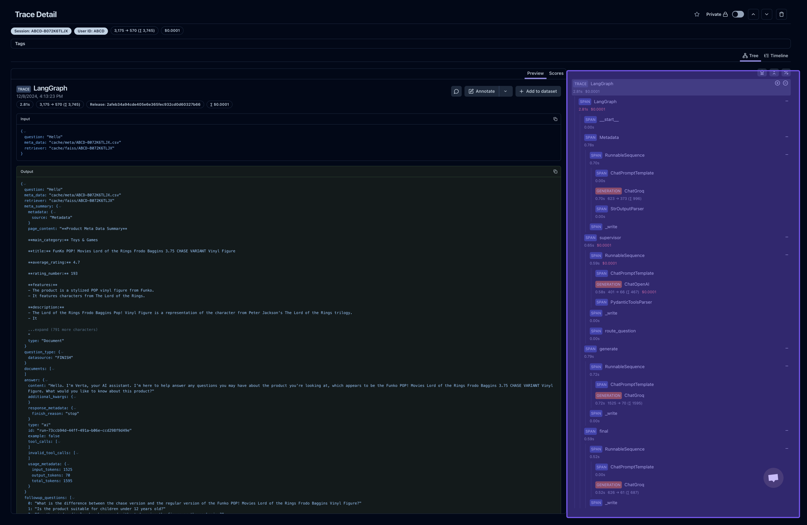

# Logging and Monitoring

## Table of Contents
1. [Introduction](../project/1-introduction.md)
2. [Scoping](../project/2-scoping.md)
3. [Data](../project/3-data.md)
4. [Modeling](../project/4-modelling.md)
5. [CI/CD](../project/5-ci_cd.md)
6. [Logging and Monitoring](../project/6-logging.md)
7. [Cost Analysis](../project/7-cost_analysis.md)

## Overview

In this project, logging and monitoring are central to ensuring the chatbot operates smoothly and effectively. From tracking user queries to monitoring system performance, logs are invaluable in diagnosing issues, optimizing responses, and understanding user interactions. With **[LangFuse Analytics](https://langfuse.com/)**, **[Google Cloud Run Logs](https://cloud.google.com/run)**, and **[Google Log Monitoring](https://cloud.google.com/logging)**, we have a powerful, comprehensive logging system to track and analyze the entire chatbot lifecycle.

Our logs help us:
- Monitor query traces and user sessions.
- Track token usage and LLM-generated responses.
- Evaluate deployments, errors, and traffic spikes.
- Keep everything in check—whether it’s the React UI traffic, backend API calls, or Cloud Run revisions.


### Langfuse Dashboard




## Logging System Breakdown

### 1. LangFuse Trace Analytics
**[LangFuse](https://langfuse.com/) is our go-to tool for detailed session and query monitoring.** Every user query is traced step-by-step, from the time it’s received to the final response. This ensures we always know how the chatbot performs, where errors occur, and how tokens are being used. [Langfuse](https://langfuse.com/) also helps in scoring user-feedback for a particular query for improving the model later on.

#### Key Features
- **Query Traces**:
  Captures each query and tracks it as it moves through various modules (retriever, LLM, etc.).
- **Token Usage**:
  - **Input Tokens**: Tokens consumed by user queries.
  - **Output Tokens**: Tokens generated in the responses.
  - **Total Tokens**: Total usage logged for each session.
- **Session Monitoring**:
  Groups related queries under a single session to provide insights into user interactions.
- **Error Logging**:
  Tracks failed responses or issues with model generation.
- **Feedback Integration**:
  Logs user feedback to evaluate and improve response accuracy.

#### What It Looks Like in the Dashboard
- **Session ID**: `4-B0B7X7PC83`
- **Input Tokens**: 8,405
- **Output Tokens**: 132
- **Latency**: 5.56s
- **Feedback**: The user marked this response as helpful.

*Langfuse helps in in-depth workflow tracing,*


#### Example LangFuse Feedback Scoring
```python
self.langfuse.score(
    id=id,
    trace_id=trace_id,
    name="user-feedback",
    value=value,
    data_type="BOOLEAN"
)
logger.info(f"Feedback Successful, 'trace_id': {trace_id}, 'id': {id}")
```


Scores are human feedback given on a response from the model. We use these scores to analyze the response and prompt engineer it for improvement.


### 2. Google Cloud Run Logs
[Cloud Run](https://cloud.google.com/run) logs keep our deployment and traffic insights intact. Whether it’s tracking API traffic or diagnosing failed requests, these logs are essential to understanding how well our deployments are scaling and responding to real-world user queries.

#### Key Features
- **Deployment Monitoring**:
  - Tracks when new model versions are deployed.
  - Logs instance auto-scaling based on traffic demand.
- **Traffic Logs**:
  - Captures front-end React app requests and API call volumes.
  - Monitors successful and failed API calls.
- **Error Reporting**:
  - Logs HTTP 4xx and 5xx errors.
  - Includes stack traces for debugging runtime issues.

#### What We See in Cloud Run Logs
- **Service**: `verta-chat-service`
- **Revision**: `verta-chat-service-00013-gh7`
- **Traffic**: 100% directed to the latest stable version.
- **Instance Autoscaling**:
  - **Max Instances**: 10
  - **CPU**: 4 cores
  - **Memory**: 16GB
- **Error Metrics**: 0.5% error rate in the last hour.


### 3. Google Log Monitoring
[Google Log Monitoring](https://cloud.google.com/logging) ties it all together with centralized insights. We use it to track API usage, monitor container logs, and even analyze front-end and back-end traffic trends.

#### Key Features
- **Centralized Monitoring**:
  Combines logs from [LangFuse](https://langfuse.com/), [Cloud Run](https://cloud.google.com/run), and API Gateway.
- **Traffic Analysis**:
  Visualizes API usage spikes, slow queries, and latency.
- **Error Alerts**:
  Configured alerts for anomalies, like a high error rate or unusual traffic spikes.
- **Cost Tracking**:
  Monitors token consumption and API costs across sessions.


## How Logs Are Used

### 1. Debugging and Error Resolution
Logs pinpoint exactly where a query fails or where latency spikes occur. We trace:
- Which module caused the error (retriever, LLM, etc.).
- Token usage and response generation at each stage.

### 2. Optimizing Model Performance
With [LangFuse](https://langfuse.com/), we track tokens consumed during input, output, and metadata retrieval. These insights guide us in:
- Reducing unnecessary token usage.
- Adjusting prompts for better LLM responses.

### 3. Deployment and Version Rollback
Using [Cloud Run](https://cloud.google.com/run) logs, we monitor deployments and quickly identify unstable revisions. If something breaks, rolling back is seamless:
1. Navigate to the [Cloud Run](https://cloud.google.com/run) **Revisions** tab.
2. Select the previous stable revision.
3. Redirect 100% of traffic to it with one click.

### 4. Analyzing User Interactions
[LangFuse](https://langfuse.com/) logs help us understand user behavior:
- Which queries are most common.
- How often do users find responses helpful (tracked via feedback).


## API Logging

Here’s what gets logged every time the chatbot is used:

### Example Request
```json
{
  "query": "hello how are you?",
  "parent_asin": "B072K6TLJX",
  "user_id": "ABCD",
  "log_langfuse": 1,
  "stream_tokens": 1
}
```

### Example Response
```json
{
  "run_id": "df46ac21-fc16-47a6-b970-12224d060cb0",
  "question": "hello how are you?",
  "answer": "Hello. I'm doing well, thank you for asking. I'm Verta, an advanced AI assistant here to help you with any product-related inquiries you may have. I'm ready to provide you with clear, accurate, and insightful responses to support your decision-making process. How can I assist you today?",
  "followup_questions": [
      "Is the Funko POP! Lord of the Rings Frodo Baggins 3.75 CHASE VARIANT Vinyl Figure suitable for display in an office setting?",
      "Does the product come with a base or stand for display?",
      "Is the vinyl figure safe for children under the age of 12 to play with?"
  ]
}
```

### Logged Details
- **Tokens Consumed**: Input - 1,500, Output - 450.
- **Session ID**: 4-XYZ123
- **Latency**: 3.25 seconds
- **Feedback**: Captured as "positive."