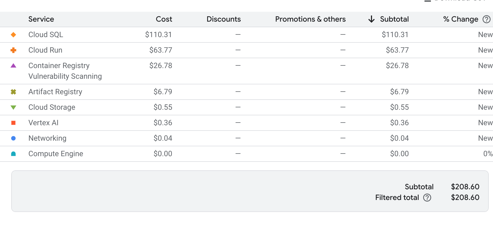

# Cost Analysis

## Table of Contents
1. [Introduction](../project/1-introduction.md)
2. [Scoping](../project/2-scoping.md)
3. [Data](../project/3-data.md)
4. [Modeling](../project/4-modelling.md)
5. [CI/CD](../project/5-ci_cd.md)
6. [Logging and Monitoring](../project/6-logging.md)
7. [Cost Analysis](../project/7-cost_analysis.md)

## Overview

This report provides a detailed breakdown of the costs incurred while deploying and operating the **Verta Chatbot** on **Google Cloud Platform (GCP)**. We'll go over each service used, what drove the costs, and how these costs can be optimized moving forward. The goal is to ensure efficient usage of resources while maintaining high performance and scalability for the project.

The total cost for this billing cycle amounted to **$208.60** for the month of November 2024, with the following key contributors:
1. Cloud SQL: The largest expense due to heavy database usage for storing and querying metadata, logs, and evaluation datasets.
2. Cloud Run: Costs associated with serverless hosting for APIs and workflows.
3. Container Registry Vulnerability Scanning: Reflecting our commitment to secure and compliant deployments.

The structure and the need for these services are directly tied to the project’s complexity and scalability requirements.

## Cost Breakdown

| **Service**                                  | **Cost (USD)** | **What It Does**                                                                                 |
|----------------------------------------------|----------------|--------------------------------------------------------------------------------------------------|
| **Cloud SQL**                                | $110.31        | Central database for storing metadata, evaluation data, and user queries.                        |
| **Cloud Run**                                | $63.77         | Hosts the serverless backend, handling LangGraph workflows and user interactions.                |
| **Container Registry Vulnerability Scanning**| $26.78         | Scans container images in the Artifact Registry for vulnerabilities before deployment.           |
| **Artifact Registry**                        | $6.79          | Stores Docker images for backend services and workflows.                                         |
| **Cloud Storage**                            | $0.55          | Temporary storage for logs, artifacts, and evaluation outputs.                                   |
| **Vertex AI**                                | $0.36          | Tracks evaluation metrics and experiments to compare model performance.                          |
| **Networking**                               | $0.04          | Internal and external traffic costs between Cloud Run, Cloud SQL, and other services.            |
| **Compute Engine**                           | $0.00          | Not actively used during this billing cycle.                                                     |

---
## ChatGPT Model Token Cost

As part of the chatbot architecture, ChatGPT (GPT-4.0 Mini) is used for generating responses. Token usage and associated costs are monitored to ensure optimal resource utilization.

## Token Costs

| **Model Name**  | **Input Cost (/1k tokens)** | **Output Cost (/1k tokens)** | **Total Cost (/1k tokens)** |
|------------------|-----------------------------|------------------------------|-----------------------------|
| **GPT-4 Mini**   | $0.01                      | $0.03                       | $0.04                      |

## Example Cost Calculation

For a query with **1,500 input tokens** and **450 output tokens**:

- **Input Cost**: `1.5 × 0.01 = $0.015`
- **Output Cost**: `0.45 × 0.03 = $0.0135`
- **Total Query Cost**: `$0.015 + $0.0135 = $0.0285`

## Monthly Token Usage Breakdown

| **Metric**                 | **Value**           |
|-----------------------------|---------------------|
| **Average Query Tokens**    | 2,500 (Input + Output) |
| **Monthly Queries**         | 50,000             |
| **Total Tokens**            | 125,000,000        |
| **Estimated Monthly Cost**  | $5,000             |

- **Cloud SQL ($110.31)**: The high cost is due to its role as the primary data storage for product metadata, chatbot logs, and evaluation queries, requiring a high I/O instance, backups for disaster recovery, and persistent connections with Cloud Run. Optimizations include query tuning, scheduling backups during off-peak hours, and downgrading the instance type during low-traffic periods.

- **Cloud Run ($63.77)**: Costs are driven by handling backend services like LangGraph workflows, APIs, and user interactions, with autoscaling increasing instances during testing. Optimizations include reducing minimum instances to zero during idle periods, shortening timeouts to avoid resource locking, and fine-tuning concurrency to maximize instance usage.

- **Container Registry Vulnerability Scanning ($26.78)**: Regular scans for [Docker](https://www.docker.com/) image vulnerabilities ensure security compliance. Optimizations involve scheduling scans only for major updates, excluding stable images from frequent scans, and focusing on critical updates.

- **Artifact Registry ($6.79)**: Hosts all [Docker](https://www.docker.com/) images for staging and production, with costs stemming from storing multiple versions. Optimizations include enabling lifecycle rules to delete unused images and manually removing deprecated versions.

- **Cloud Storage ($0.55)**: Used for temporary storage of evaluation results, logs, and workflow artifacts, with small-scale usage driving costs. Optimizations include moving older logs to Nearline Storage and automating stale data deletion after 30 days.

- **Vertex AI ($0.36)**: Tracks experiment results and evaluation metrics, with light usage for logging. Optimizations include logging only essential fields and archiving older experiments post-analysis.

- **Networking ($0.04)**: Minimal costs arise from data transfer between services like Cloud Run and Cloud SQL. Optimizations include using private IP connections to minimize external traffic and reducing unnecessary API calls.

## Cost Summary

- **Total Cost**: $208.60
  - Cloud SQL: 52.87%
  - Cloud Run: 30.58%
  - Container Scanning: 12.84%
  - Other services: 3.71%

## Optimization Opportunities

### Short-Term
1. Lower minimum instance counts in **[Cloud Run](https://cloud.google.com/run)** during off-hours.
2. Schedule **vulnerability scans** only for major updates.
3. Delete old [Docker](https://www.docker.com/) images from the **[Artifact Registry](https://cloud.google.com/artifact-registry/docs)**.

### Long-Term
1. Use **Coldline Storage** for archiving older logs and evaluation data.
2. Consolidate metrics tracking to **[Vertex AI](https://cloud.google.com/vertex-ai)** for reduced redundancy.
3. Automate instance scaling and downgrading for **[Cloud SQL](https://cloud.google.com/sql)** during non-peak periods.

## Structure of the Cost

### What caused the costs to rise?
1. Heavy database usage from [Cloud SQL](https://cloud.google.com/sql) due to real-time queries and storage needs.
2. [Cloud Run](https://cloud.google.com/run)’s autoscaling handled intense evaluation and testing workloads.
3. Regular container scans added a consistent layer of expense.

### How are the costs justified?
These costs reflect the project’s **scalable infrastructure**:
- Real-time analytics and processing in [Cloud Run](https://cloud.google.com/run).
- Secure image deployments via Container Registry.
- Centralized data storage and querying through [Cloud SQL](https://cloud.google.com/sql).

## Future Cost Monitoring

To keep costs under control, we’ll:
1. **Set budget alerts** in GCP to monitor expenses.
2. **Enable cost dashboards** for real-time tracking of each service.
3. **Implement automation** for scaling, archiving, and cleanup tasks.

